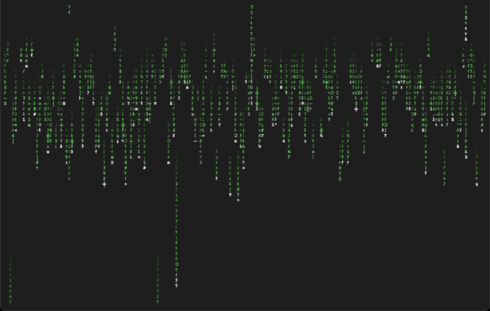

# raincode

A modern terminal clone of the classic `cmatrix` screensaver, built with React Ink and brought up to 2026 with true-color rendering, AI-generated messages, and full screensaver polish.



---

## Inspiration

`cmatrix` was written by Chris Allegretta in 1999, inspired by the opening title sequence of *The Matrix*. The film's digital rain was designed by production designer Simon Whiteley, who fed pages from his wife's Japanese sushi cookbook through a scanner and composited the characters into the cascading green columns that became one of cinema's most iconic visual motifs.

`raincode` reimplements that effect from scratch in TypeScript, faithful to the source material but taking full advantage of what modern terminals and AI APIs make possible in 2026:

- **24-bit true-color** phosphor gradients rather than 8-color approximations
- **Film-accurate character set** — the actual half-width katakana block (`ｦ`–`ﾝ`) used by Whiteley, paired with the symbols and digits from the rain
- **Character mutation** — tail cells randomly re-roll their glyph each tick, matching the shimmering look of the film
- **Flash bursts** — random cells briefly flare to near-head brightness
- **AI-generated messages** — Claude (claude-haiku-4-5) streams short Matrix-themed phrases that surface letter by letter in the rain, just like the hidden text easter eggs in the original film
- **Full screensaver behavior** — alternate screen buffer, cursor hide/restore, macOS `caffeinate` integration
- **Low-overhead animation** — typed arrays and in-place mutation for all per-cell state; physics at 20 fps, React renders at 10 fps; dormant columns fast-pathed to avoid cell work

---

## Installation

**Prerequisites:** [Bun](https://bun.sh) 1.x

```bash
git clone <repo>
cd raincode
bun install
```

Run directly:

```bash
bun run matrix
```

Or link as a global command:

```bash
bun link
raincode
```

**AI messages** require an Anthropic API key (or any AI SDK-compatible gateway) in your environment. Without one, pass `--no-ai` to skip AI generation.

---

## Usage

```
raincode [options]
```

### Keybindings

| Key | Action |
|-----|--------|
| `q` / `Ctrl-C` | Quit |
| `+` / `=` | Increase speed by 0.25 |
| `-` | Decrease speed by 0.25 |
| `r` | Randomize all columns |

Speed is clamped to the range `0.1`–`5.0`. Changes take effect on new columns as they spawn; existing streams finish their current run at their prior speed.

---

### `--speed <n>`

**Default:** `1.0`

A floating-point multiplier applied to every column's fall speed. Each column already has a randomized base speed; this scales all of them together.

| Value | Effect |
|-------|--------|
| `0.25` | Very slow, contemplative |
| `0.5` | Half speed — good for readability |
| `1.0` | Default film-like pace |
| `2.0` | Double speed |
| `4.0` | Frantic, barely legible |

There is no hard cap, but values above `5.0` will outpace the 50 ms render tick and produce no visible difference.

---

### `--density <n>`

**Default:** `1.0`

A value between `0.0` and `1.0` controlling what fraction of terminal columns are actively raining. Columns that lose the density roll are dormant for the entire session.

| Value | Effect |
|-------|--------|
| `1.0` | Every column active (default) |
| `0.75` | ~¾ of columns active |
| `0.5` | Half the screen raining — open, sparse look |
| `0.25` | Scattered individual streams |
| `0.1` | Barely there |

---

### `--theme <name>`

**Default:** `classic`

Selects a named color preset. Each theme defines a head color (the leading cell) and a base color (the body of the tail). The full phosphor gradient is derived from those two values.

| Name | Head | Base | Description |
|------|------|------|-------------|
| `classic` | white | `#00ff41` | Film-accurate matrix green |
| `blue` | white | `#4488ff` | Zion operator console |
| `red` | white | `#ff2200` | Red pill / danger |
| `architect` | white | `#ffffff` | The Architect's white room |
| `amber` | white | `#ffaa00` | Old-school phosphor amber |

Can be combined with `--color` to use a theme's head color with a custom base.

---

### `--color <hex>`

**Default:** none (uses the theme's base color)

Overrides the base rain color with any 24-bit hex value. The head remains white and the full phosphor gradient is rebuilt from this color. Accepts standard CSS hex notation.

```bash
raincode --color "#00ccff"   # cyan
raincode --color "#ff00ff"   # magenta
raincode --color "#ffffff"   # all white (same as --theme architect)
```

---

### `--message <text>`

**Default:** none (AI-generated messages are used instead)

Pins a specific message to cycle through the rain indefinitely. The text is uppercased and stripped of punctuation automatically. At most two columns spell out a message simultaneously; the rest continue as normal rain.

Messages longer than 12 characters will be truncated to fit within a column. For multi-word phrases, spaces are preserved as blank cells in the rain.

```bash
raincode --message "WAKE UP"
raincode --message "FOLLOW THE WHITE RABBIT"
raincode --message "THERE IS NO SPOON"
```

When `--message` is set, AI generation is automatically bypassed.

---

### `--timeout <s>`

**Default:** none (runs indefinitely)

Exits cleanly after the given number of seconds. A `MM:SS` countdown is displayed in the bottom-right corner of the screen while the timer is running, rendered in the active theme's base color.

```bash
raincode --timeout 60     # 1 minute
raincode --timeout 300    # 5 minutes — useful as a screensaver
raincode --timeout 3600   # 1 hour
```

---

### `--no-ai`

Disables the AI message queue entirely. The rain runs as pure noise with no phrases surfacing. Use this if you have no API key configured, want a lower-distraction display, or are in an offline environment.

---

### `--help`

Prints a short usage reference and exits.

---

### Themes

| Name | Description |
|------|-------------|
| `classic` | Film-accurate matrix green |
| `blue` | Zion operator console |
| `red` | Red pill / danger |
| `architect` | The Architect's white room |
| `amber` | Old-school phosphor amber |

---

### Examples

```bash
# Slower, sparser rain
raincode --speed 0.5 --density 0.6

# Red theme, faster
raincode --theme red --speed 1.8

# Custom color
raincode --color "#00ccff"

# Force a message into the rain
raincode --message "THERE IS NO SPOON"

# Run as a screensaver for 5 minutes
raincode --timeout 300

# No AI, classic look
raincode --no-ai
```

### Config file

Persistent defaults can be stored at `~/.config/raincode/config.json`. CLI flags override file values.

```json
{
  "theme": "classic",
  "speed": 1.0,
  "density": 1.0,
  "noAi": false
}
```
